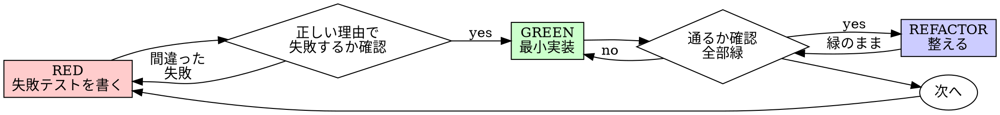

# テスト駆動開発（TDD）

## 概要

先にテストを書く。失敗するのを見届ける。テストを通す最小限のコードを書く。

**核となる原則:** テストが失敗するのを目で確認していないなら、そのテストが正しいものを検証しているか分からない。

**ルールの文字を破ることは、ルールの精神を破ることである。**

## いつ使うか

**常に使う:**

- 新機能の追加
- バグ修正
- リファクタリング
- 振る舞いの変更

**例外（あなたの human partner に相談すること）:**

- 使い捨てのプロトタイプ
- 自動生成コード
- 設定ファイル

「今回だけ TDD をスキップしよう」と考えた? 止まれ。それは合理化（rationalization）だ。

## 鉄の掟（The Iron Law）

```
失敗するテストなしに、本番コードを書いてはならない
```

テストより先にコードを書いた? 削除しろ。やり直し。

**例外なし:**

- 「参考」として残してはいけない
- テストを書く間に「合わせて」改変してはいけない
- 見てもいけない
- 削除とは削除のこと

テストから新鮮に実装する。それだけ。

## Red-Green-Refactor



### RED — 失敗テストを書く

「何が起きるべきか」を表す最小のテストを1つ書く。

<Good>
```typescript
test('失敗した処理を3回までリトライする', async () => {
  let attempts = 0;
  const operation = () => {
    attempts++;
    if (attempts < 3) throw new Error('fail');
    return 'success';
  };

  const result = await retryOperation(operation);

  expect(result).toBe('success');
  expect(attempts).toBe(3);
});
```
名前が明確、本物の振る舞いをテスト、検証が1つ
</Good>

<Bad>
```typescript
test('retry が動く', async () => {
  const mock = jest.fn()
    .mockRejectedValueOnce(new Error())
    .mockRejectedValueOnce(new Error())
    .mockResolvedValueOnce('success');
  await retryOperation(mock);
  expect(mock).toHaveBeenCalledTimes(3);
});
```
名前が曖昧、コードではなくモックをテストしている
</Bad>

**要件:**

- 1つの振る舞いだけ
- 明確な名前
- 本物のコード（避けられない場合のみモック）

### Verify RED — 失敗を目で見る

**必須。絶対にスキップしない。**

```bash
npm test path/to/test.test.ts
```

確認すること:

- テストが失敗する（エラーではなく）
- 失敗メッセージが期待通り
- 「機能が未実装だから」失敗している（typo ではなく）

**テストが通った?** 既存の振る舞いをテストしているだけ。テストを直す。

**テストがエラーを出した?** エラーを直し、正しく失敗するまで再実行する。

### GREEN — 最小実装

テストを通す最も単純なコードを書く。

<Good>
```typescript
async function retryOperation<T>(fn: () => Promise<T>): Promise<T> {
  for (let i = 0; i < 3; i++) {
    try {
      return await fn();
    } catch (e) {
      if (i === 2) throw e;
    }
  }
  throw new Error('unreachable');
}
```
通すために必要な最小限だけ
</Good>

<Bad>
```typescript
async function retryOperation<T>(
  fn: () => Promise<T>,
  options?: {
    maxRetries?: number;
    backoff?: 'linear' | 'exponential';
    onRetry?: (attempt: number) => void;
  }
): Promise<T> {
  // YAGNI
}
```
やり過ぎ
</Bad>

機能を追加するな、他のコードをリファクタするな、テストの範囲を超えて「改善」するな。

### Verify GREEN — 通ることを目で見る

**必須。**

```bash
npm test path/to/test.test.ts
```

確認すること:

- 対象のテストが通る
- 他のテストも通ったまま
- 出力がきれい（エラー・警告なし）

**テストが落ちた?** コードを直す。テストではない。

**他のテストが落ちた?** 今すぐ直す。

### REFACTOR — 整える

緑になった後だけやる:

- 重複の除去
- 命名の改善
- ヘルパーへの抽出

テストは緑のまま保つ。振る舞いを足さない。

### 繰り返し

次の機能のために、次の失敗テストを書く。

## 良いテスト

| 性質 | Good | Bad |
|------|------|-----|
| **最小** | 1つのことだけ。「〜と〜」が名前にある? 分割しろ。 | `test('email とドメインと空白を検証する')` |
| **明確** | 名前が振る舞いを説明する | `test('test1')` |
| **意図を示す** | 望ましい API を示している | コードが何をすべきか曖昧 |

## なぜ順序が重要か

**「動作確認は実装後にテストでやればいい」**

実装後に書いたテストはすぐに通る。すぐ通ることは何も証明しない:

- 違うものをテストしているかもしれない
- 振る舞いではなく実装をテストしているかもしれない
- 忘れたエッジケースを見逃しているかもしれない
- バグをキャッチする瞬間を一度も見ていない

テストファーストは、テストが実際に何かを検証していることを目で確認させる。

**「もう手動でエッジケース全部試した」**

手動テストは場当たり的だ。全部テストしたつもりでも:

- 何をテストしたか記録がない
- コードが変わったときに再実行できない
- プレッシャーの下では忘れがち
- 「やってみたら動いた」≠ 網羅的

自動テストは体系的。毎回同じように走る。

**「X 時間分のコードを消すのはもったいない」**

サンクコスト・バイアスだ。時間はもう消えている。今の選択肢は:

- 削除して TDD で書き直す（X 時間追加、信頼度高い）
- 残してテストを後で足す（30分、信頼度低い、バグの可能性高い）

「もったいない」のは、信頼できないコードを残すこと。テストのない動くコードは技術的負債。

**「TDD は教条的、現実的にやるなら適応すべき」**

TDD こそ現実的:

- コミット前にバグを見つける（後でデバッグするより速い）
- 退行を防ぐ（テストが破壊を即検出）
- 振る舞いをドキュメント化（テストが使い方を示す）
- リファクタリングを可能にする（自由に変えられる、テストが破壊を捕捉）

「現実的」な近道 = 本番でデバッグ = 結果的に遅い。

**「後付けテストでも目的は同じ。儀式ではなく精神が大事」**

違う。後付けテストは「これは何をするか?」に答える。先に書くテストは「これは何をすべきか?」に答える。

後付けテストは実装に引きずられる。作ったものをテストするだけで、要求されているものはテストしない。覚えているエッジケースを検証するだけで、発見されたものは検証しない。

先に書くテストは、実装する前にエッジケースの発見を強制する。後付けテストは「全部覚えていたか」を検証する（覚えていない）。

実装後の30分のテスト ≠ TDD。カバレッジは得るが、テストが本当に効くという証明を失う。

## よくある合理化

| 言い訳 | 現実 |
|--------|------|
| 「単純すぎてテスト不要」 | 単純なコードも壊れる。テストは30秒で書ける。 |
| 「あとでテストする」 | すぐ通るテストは何も証明しない。 |
| 「後付けでも目的は達成できる」 | 後付け = 「これは何をするか?」、先に書く = 「これは何をすべきか?」 |
| 「もう手動で確認した」 | 場当たり ≠ 体系的。記録なし、再実行不可。 |
| 「X 時間消すのはもったい」 | サンクコスト・バイアス。検証されないコードは技術的負債。 |
| 「参考に残してテストを書く」 | 結局合わせ込む。それは後付けテスト。削除とは削除。 |
| 「先に探索が必要」 | OK。探索コードは捨て、TDD で始め直す。 |
| 「テストが書きにくい = 設計が不明瞭」 | テストの声を聞け。テストしにくい = 使いにくい。 |
| 「TDD は遅くなる」 | TDD はデバッグより速い。現実的 = テストファースト。 |
| 「手動の方が速い」 | 手動はエッジケースを証明しない。変更ごとに再テストになる。 |
| 「既存コードにテストがない」 | あなたが改善する。既存コードにもテストを足す。 |

## レッドフラグ — 止まってやり直し

- テストより先にコード
- 実装の後にテスト
- テストがすぐ通る
- なぜテストが落ちたか説明できない
- テストを「後で」足す
- 「今回だけ」を合理化
- 「もう手動で試した」
- 「後付けでも目的は同じ」
- 「儀式ではなく精神」
- 「参考に残す」「既存コードに合わせる」
- 「もう X 時間使った、消すのはもったい」
- 「TDD は教条的、自分は現実的」
- 「これは違う、なぜなら…」

**これらすべてが意味するのは: コードを削除し、TDD でやり直すこと。**

## 例: バグ修正

**バグ:** 空の email が受け付けられる

**RED**
```typescript
test('空 email を拒否する', async () => {
  const result = await submitForm({ email: '' });
  expect(result.error).toBe('Email required');
});
```

**Verify RED**
```bash
$ npm test
FAIL: expected 'Email required', got undefined
```

**GREEN**
```typescript
function submitForm(data: FormData) {
  if (!data.email?.trim()) {
    return { error: 'Email required' };
  }
  // ...
}
```

**Verify GREEN**
```bash
$ npm test
PASS
```

**REFACTOR**
複数フィールドが必要になれば、バリデーションを抽出する。

## 検証チェックリスト

作業完了と宣言する前に:

- [ ] 新しい関数・メソッドそれぞれにテストがある
- [ ] 実装前に、各テストが失敗するのを見届けた
- [ ] 各テストが期待した理由（機能未実装、typo ではない）で失敗した
- [ ] 各テストを通す最小コードを書いた
- [ ] すべてのテストが通る
- [ ] 出力がきれい（エラー・警告なし）
- [ ] テストは本物のコードを使っている（モックは避けられない場合のみ）
- [ ] エッジケースとエラーをカバーしている

全部チェックできない? それは TDD をスキップしている。やり直し。

## 詰まったとき

| 問題 | 解決 |
|------|------|
| テストの書き方が分からない | 「こうあって欲しい API」を書く。assertion から書く。human partner に聞く。 |
| テストが複雑すぎる | 設計が複雑すぎる。インターフェースを単純化。 |
| 全部モックする必要がある | コードが密結合。依存性注入を使う。 |
| テストの setup が巨大 | ヘルパーに抽出。それでも複雑なら設計を単純化。 |

## デバッグとの統合

バグを見つけた? 再現する失敗テストを書け。TDD サイクルを回せ。テストが修正を証明し、退行を防ぐ。

テストなしでバグを直してはいけない。

## テスト・アンチパターン

モックやテストユーティリティを足すときは、よくある落とし穴を避けるため `@testing-anti-patterns.md` を読む:

- 本物の振る舞いではなくモックの振る舞いをテストする
- 本番クラスにテスト専用メソッドを足す
- 依存関係を理解せずにモックする

## 最終ルール

```
本番コード → テストが存在し、それは先に失敗していた
そうでなければ → TDD ではない
```

human partner の許可なく例外を作らない。
